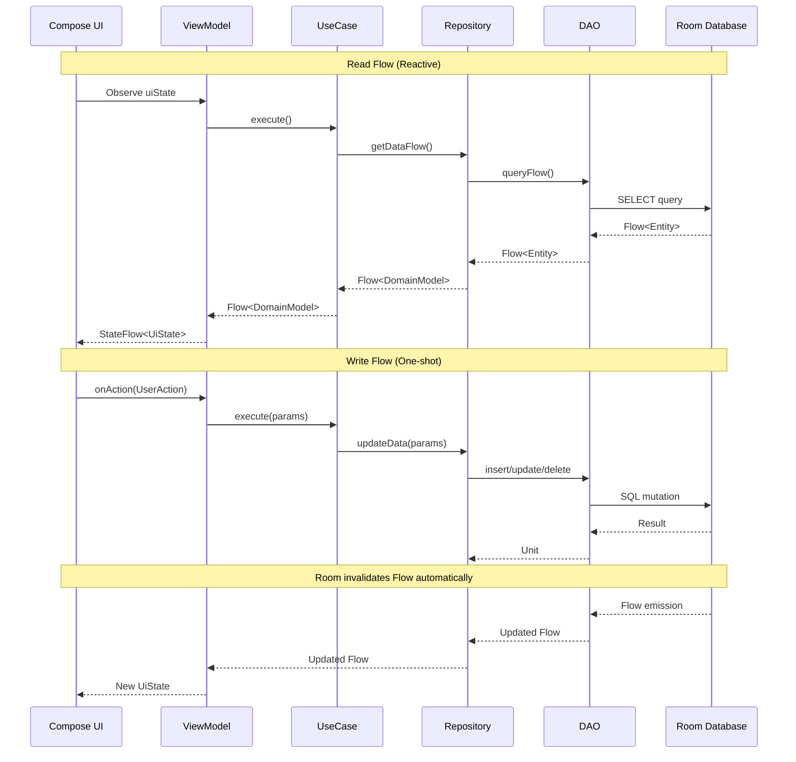
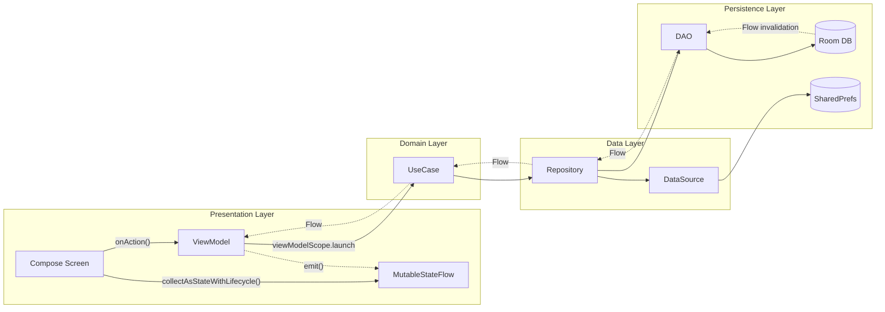
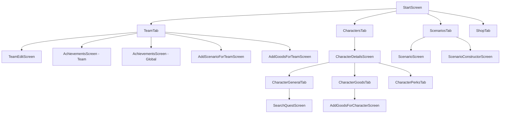

# Gloomhaven Helper - Technical Architecture Documentation

## Database Layer (Room/SQLite)

### Database Configuration

- **Database Name:** `glHelperDatabase`
- **Version:** 1

### Entity-Relationship Diagram

```mermaid
erDiagram
    TeamBd ||--o{ CharacterBd : "has"
    TeamBd ||--o{ TeamScenarioBd : "has"
    TeamBd ||--o{ TeamGoodBd : "has"
    TeamBd ||--o{ TeamCharacterClassBd : "has"
    ScenarioBd ||--o{ TeamScenarioBd : "referenced by"
    CharacterBd ||--o{ CharacterGoodBd : "owns"
    CharacterBd ||--o{ CharacterPerkBd : "has"
    CharacterBd ||--o{ CharacterPersonalQuestBd : "assigned"
    GoodBd ||--o{ CharacterGoodBd : "referenced by"
    GoodBd ||--o{ TeamGoodBd : "referenced by"
    PerkBd ||--o{ CharacterPerkBd : "referenced by"
    PersonalQuestBd ||--o{ CharacterPersonalQuestBd : "referenced by"
    MonsterBd ||--o{ MonsterStatsBd : "has stats"
    MonsterBd }o--o{ MonsterAbilityCardBd : "uses deck by deckName"

    TeamBd {
        int teamId PK "AUTOINCREMENT"
        string name
        string teamAchievement "JSON List<Achievement>"
        string globalAchievement "JSON List<Achievement>"
        string packs "JSON List<String>"
        int reputation
        int prosperity
    }

    CharacterBd {
        int characterId PK "AUTOINCREMENT"
        string name
        int level
        int experience
        int goldCount
        string characterType "enum CharacterClassType"
        int teamId FK "NULLABLE"
        boolean isAlive
        string notes
        int checkMarkCount
    }

    GameLevelInfoBd {
        int level PK
        int monsterLevel
        int goldCount
        int trapDamage
        int experience
    }

    ScenarioBd {
        int scenarioNumber PK
        string name
        string newScenarios
        string teamAchievement
        string globalAchievement
        string requirements
        string pack
    }

    TeamScenarioBd {
        int id PK "AUTOINCREMENT"
        int teamId FK
        int scenarioNumber FK
        string scenarioName
        string scenarioRequirements
        boolean completed
    }

    GoodBd {
        int goodId PK "AUTOINCREMENT"
        int number
        string name
        string type
        int cost
        boolean is_drawing
        string pack
    }

    CharacterGoodBd {
        int id PK "AUTOINCREMENT"
        int characterId FK
        int goodId FK
    }

    TeamGoodBd {
        int id PK "AUTOINCREMENT"
        int teamId FK
        int goodId FK
    }

    TeamCharacterClassBd {
        int id PK "AUTOINCREMENT"
        int teamId FK
        string characterType "enum CharacterClassType"
    }

    PerkBd {
        int perkId PK "AUTOINCREMENT"
        string text
        string characterType "enum CharacterClassType"
    }

    CharacterPerkBd {
        int id PK "AUTOINCREMENT"
        int characterId FK
        int perkId FK
    }

    PersonalQuestBd {
        string questId PK
        string title
        string description
        string specialText
        string characterType "NULLABLE"
        string tasks "JSON"
    }

    CharacterPersonalQuestBd {
        int id PK "AUTOINCREMENT"
        int characterId FK
        string questId FK
        string tasks "JSON"
    }

    AchievementBd {
        int achievementId PK "AUTOINCREMENT"
        string name
        string pack
        int maxRang
        boolean isGlobal
    }

    MonsterBd {
        int monsterId PK "AUTOINCREMENT"
        string name
        string deckName "references ability card deck"
        boolean isBoss
        boolean fly
        boolean lifeMultiple
        string immunity "JSON List<MonsterStatType>"
        string pack "enum PackType"
    }

    MonsterStatsBd {
        int monsterId PK_FK
        int scenarioLevel PK
        boolean isElite PK
        int life
        string stats "JSON List<MonsterStatType>"
    }

    MonsterAbilityCardBd {
        int cardId PK "AUTOINCREMENT"
        string deckName "deck identifier"
        int initiative
        string actions "JSON List<MonsterAction>"
        boolean needsShuffle
    }

    ScenarioGameStateBd {
        string name PK
        int scenarioNumber "NULLABLE"
        string monsterNames "JSON List<String>"
        int round
        string availableCards "JSON List<Int>"
        string activeMonsters "JSON List<ScenarioGameStateMonsterItem>"
        string magicChargeMap "JSON List<ScenarioGameStateMagic>"
    }
```

**Note:** Character classes are stored as enum `CharacterClassType` in code, not as a separate database table. The `TeamCharacterClassBd` table tracks which classes are unlocked for each team.

### Entity Definitions

#### TeamBd
| Column | Type | Constraints |
|--------|------|-------------|
| `teamId` | INTEGER | PRIMARY KEY, AUTOINCREMENT, NOT NULL |
| `name` | TEXT | NOT NULL |
| `teamAchievement` | TEXT | NOT NULL, JSON serialized List<Achievement> |
| `globalAchievement` | TEXT | NOT NULL, JSON serialized List<Achievement> |
| `packs` | TEXT | NOT NULL, JSON serialized List<String> |
| `reputation` | INTEGER | NOT NULL |
| `prosperity` | INTEGER | NOT NULL |

#### CharacterBd
| Column | Type | Constraints |
|--------|------|-------------|
| `characterId` | INTEGER | PRIMARY KEY, AUTOINCREMENT, NOT NULL |
| `name` | TEXT | NOT NULL |
| `level` | INTEGER | NOT NULL |
| `experience` | INTEGER | NOT NULL |
| `goldCount` | INTEGER | NOT NULL |
| `characterType` | TEXT | NOT NULL |
| `teamId` | INTEGER | NULLABLE |
| `isAlive` | INTEGER | NOT NULL |
| `notes` | TEXT | NOT NULL |
| `checkMarkCount` | INTEGER | NOT NULL |

#### AchievementBd
| Column | Type | Constraints |
|--------|------|-------------|
| `achievementId` | INTEGER | PRIMARY KEY, AUTOINCREMENT, NOT NULL |
| `name` | TEXT | NOT NULL |
| `pack` | TEXT | NOT NULL |
| `maxRang` | INTEGER | NOT NULL, DEFAULT 1 |
| `isGlobal` | INTEGER | NOT NULL |

#### GameLevelInfoBd
| Column | Type | Constraints |
|--------|------|-------------|
| `level` | INTEGER | PRIMARY KEY, NOT NULL |
| `monsterLevel` | INTEGER | NOT NULL |
| `goldCount` | INTEGER | NOT NULL |
| `trapDamage` | INTEGER | NOT NULL |
| `experience` | INTEGER | NOT NULL |

#### ScenarioBd
| Column | Type | Constraints |
|--------|------|-------------|
| `scenarioNumber` | INTEGER | PRIMARY KEY, NOT NULL |
| `name` | TEXT | NOT NULL |
| `newScenarios` | TEXT | NOT NULL |
| `teamAchievement` | TEXT | NOT NULL |
| `globalAchievement` | TEXT | NOT NULL |
| `requirements` | TEXT | NOT NULL |
| `pack` | TEXT | NOT NULL |

#### TeamScenarioBd
| Column | Type | Constraints |
|--------|------|-------------|
| `id` | INTEGER | PRIMARY KEY, AUTOINCREMENT, NOT NULL |
| `teamId` | INTEGER | FK → TeamBd(teamId), ON DELETE CASCADE |
| `scenarioNumber` | INTEGER | FK → ScenarioBd(scenarioNumber), ON DELETE CASCADE |
| `scenarioName` | TEXT | NOT NULL |
| `scenarioRequirements` | TEXT | NOT NULL |
| `completed` | INTEGER | NOT NULL |

**Indices:**
- `index_TeamScenarioBd_teamId` on `teamId`
- `index_TeamScenarioBd_scenarioNumber` on `scenarioNumber`

#### GoodBd
| Column | Type | Constraints |
|--------|------|-------------|
| `goodId` | INTEGER | PRIMARY KEY, AUTOINCREMENT, NOT NULL |
| `number` | INTEGER | NOT NULL |
| `name` | TEXT | NOT NULL |
| `type` | TEXT | NOT NULL |
| `cost` | INTEGER | NOT NULL |
| `is_drawing` | INTEGER | NOT NULL |
| `pack` | TEXT | NOT NULL |

#### CharacterGoodBd
| Column | Type | Constraints |
|--------|------|-------------|
| `id` | INTEGER | PRIMARY KEY, AUTOINCREMENT, NOT NULL |
| `characterId` | INTEGER | FK → CharacterBd(characterId), ON DELETE CASCADE |
| `goodId` | INTEGER | FK → GoodBd(goodId), ON DELETE CASCADE |

**Indices:**
- `index_CharacterGoodBd_characterId` on `characterId`
- `index_CharacterGoodBd_goodId` on `goodId`

#### TeamGoodBd
| Column | Type | Constraints |
|--------|------|-------------|
| `id` | INTEGER | PRIMARY KEY, AUTOINCREMENT, NOT NULL |
| `teamId` | INTEGER | FK → TeamBd(teamId), ON DELETE CASCADE |
| `goodId` | INTEGER | FK → GoodBd(goodId), ON DELETE CASCADE |

**Indices:**
- `index_TeamGoodBd_teamId` on `teamId`
- `index_TeamGoodBd_goodId` on `goodId`

#### TeamCharacterClassBd
| Column | Type | Constraints |
|--------|------|-------------|
| `id` | INTEGER | PRIMARY KEY, AUTOINCREMENT, NOT NULL |
| `teamId` | INTEGER | FK → TeamBd(teamId), ON DELETE CASCADE |
| `characterType` | TEXT | NOT NULL, enum CharacterClassType |

**Indices:**
- `index_TeamCharacterClassBd_teamId` on `teamId`
- `index_TeamCharacterClassBd_characterType` on `characterType`

#### PerkBd
| Column | Type | Constraints |
|--------|------|-------------|
| `perkId` | INTEGER | PRIMARY KEY, AUTOINCREMENT, NOT NULL |
| `text` | TEXT | NOT NULL |
| `characterType` | TEXT | NOT NULL, enum CharacterClassType |

**Indices:**
- `index_PerkBd_characterType` on `characterType`

#### CharacterPerkBd
| Column | Type | Constraints |
|--------|------|-------------|
| `id` | INTEGER | PRIMARY KEY, AUTOINCREMENT, NOT NULL |
| `characterId` | INTEGER | FK → CharacterBd(characterId), ON DELETE CASCADE |
| `perkId` | INTEGER | FK → PerkBd(perkId), ON DELETE CASCADE |

**Indices:**
- `index_CharacterPerkBd_characterId` on `characterId`
- `index_CharacterPerkBd_perkId` on `perkId`

#### PersonalQuestBd
| Column | Type | Constraints |
|--------|------|-------------|
| `questId` | TEXT | PRIMARY KEY, NOT NULL |
| `title` | TEXT | NOT NULL |
| `description` | TEXT | NOT NULL |
| `specialText` | TEXT | NOT NULL |
| `characterType` | TEXT | NULLABLE |
| `tasks` | TEXT | NOT NULL, JSON serialized |

#### CharacterPersonalQuestBd
| Column | Type | Constraints |
|--------|------|-------------|
| `id` | INTEGER | PRIMARY KEY, AUTOINCREMENT, NOT NULL |
| `characterId` | INTEGER | FK → CharacterBd(characterId), ON DELETE CASCADE |
| `questId` | TEXT | FK → PersonalQuestBd(questId), ON DELETE CASCADE |
| `tasks` | TEXT | NOT NULL, JSON serialized |

**Indices:**
- `index_CharacterPersonalQuestBd_characterId` on `characterId`
- `index_CharacterPersonalQuestBd_questId` on `questId`

#### MonsterBd
| Column | Type | Constraints |
|--------|------|-------------|
| `monsterId` | INTEGER | PRIMARY KEY, AUTOINCREMENT, NOT NULL |
| `name` | TEXT | NOT NULL |
| `deckName` | TEXT | NOT NULL, references ability card deck |
| `isBoss` | INTEGER | NOT NULL |
| `fly` | INTEGER | NOT NULL, DEFAULT 0 |
| `lifeMultiple` | INTEGER | NOT NULL, DEFAULT 0 |
| `immunity` | TEXT | NOT NULL, JSON serialized List<MonsterStatType> |
| `pack` | TEXT | NOT NULL, DEFAULT "MAIN" |

**Note:** Multiple monsters can share the same `deckName`, allowing different monster types to use the same ability card deck. Monsters are filtered by `pack` field to match team's enabled packs.

#### MonsterStatsBd
| Column | Type | Constraints |
|--------|------|-------------|
| `monsterId` | INTEGER | PRIMARY KEY (composite), FK → MonsterBd(monsterId), ON DELETE CASCADE |
| `scenarioLevel` | INTEGER | PRIMARY KEY (composite), NOT NULL |
| `isElite` | INTEGER | PRIMARY KEY (composite), NOT NULL |
| `life` | INTEGER | NOT NULL |
| `stats` | TEXT | NOT NULL, JSON serialized List<MonsterStat> |

**Indices:**
- `index_MonsterStatsBd_monsterId` on `monsterId`

#### MonsterAbilityCardBd
| Column | Type | Constraints |
|--------|------|-------------|
| `cardId` | INTEGER | PRIMARY KEY, AUTOINCREMENT, NOT NULL |
| `deckName` | TEXT | NOT NULL, deck identifier |
| `initiative` | INTEGER | NOT NULL |
| `actions` | TEXT | NOT NULL, JSON serialized List<CardAction> |
| `needsShuffle` | INTEGER | NOT NULL, default 0 |

**Indices:**
- `index_MonsterAbilityCardBd_deckName` on `deckName`

**Note:** Cards are grouped by `deckName`. Monsters reference cards through their `deckName` field, enabling multiple monsters to share the same ability deck.

#### ScenarioGameStateBd
| Column | Type | Constraints |
|--------|------|-------------|
| `name` | TEXT | PRIMARY KEY, NOT NULL |
| `scenarioNumber` | INTEGER | NULLABLE |
| `monsterNames` | TEXT | NOT NULL, JSON serialized List<String> |
| `round` | INTEGER | NOT NULL, DEFAULT 0 |
| `availableCards` | TEXT | NOT NULL, JSON serialized List<Int> |
| `activeMonsters` | TEXT | NOT NULL, JSON serialized List<ScenarioGameStateMonsterItem> |
| `magicChargeMap` | TEXT | NOT NULL, JSON serialized List<ScenarioGameStateMagic> |

**Note:** Stores the current game state for active scenario play, including monster positions, health, and ability card deck state.

### TypeConverters

#### ListCharacterTaskItemTypeConverter
Serializes `List<CharacterTaskItem>` to JSON string for storage in `PersonalQuestBd.tasks` and `CharacterPersonalQuestBd.tasks`.

#### CardActionsTypeConverter
Serializes `List<MonsterAction>` to JSON string for storage in `MonsterAbilityCardBd.actions`.

#### MonsterStatTypeConverter
Serializes `List<MonsterStatType>` to JSON string for storage in `MonsterStatsBd.stats` and `MonsterBd.immunity`.

#### AchievementConverter
Serializes `List<Achievement>` to JSON string for storage in `TeamBd.teamAchievement` and `TeamBd.globalAchievement`.

#### StringListTypeConverter
Serializes `List<String>` to JSON string for storage in `TeamBd.packs` and `ScenarioGameStateBd.monsterNames`.

#### ScenarioConverters
Handles multiple type conversions for `ScenarioGameStateBd`:
- `List<Int>` for `availableCards`
- `List<ScenarioGameStateMagic>` for `magicChargeMap`
- `List<ScenarioGameStateMonsterItem>` for `activeMonsters`

### DAO Interfaces

#### TeamDao
| Method | Annotation | Query |
|--------|-----------|-------|
| `getAll()` | `@Query` | `SELECT * FROM TeamBd` |
| `getAllFlow()` | `@Query` | `SELECT * FROM TeamBd` → `Flow<List<TeamBd>>` |
| `findById(id)` | `@Query` | `SELECT * FROM TeamBd WHERE teamId LIKE :id LIMIT 1` |
| `insert(team)` | `@Upsert` | — |
| `delete(team)` | `@Delete` | — |
| `deleteById(id)` | `@Query` | `DELETE FROM TeamBd WHERE teamId = :id` |
| `update(team)` | `@Update` | — |
| `getTeamWithScenariosFlow(id)` | `@Transaction @Query` | `SELECT * FROM TeamBd WHERE teamId LIKE :id LIMIT 1` → `Flow<TeamWithScenariosBd>` |
| `getTeamWithScenarios(id)` | `@Transaction @Query` | `SELECT * FROM TeamBd WHERE teamId LIKE :id LIMIT 1` |
| `updateReputation(id, reputation)` | `@Transaction @Query` | `UPDATE TeamBd SET reputation=:reputation WHERE teamId = :id` |
| `updateProsperity(id, prosperity)` | `@Transaction @Query` | `UPDATE TeamBd SET prosperity=:prosperity WHERE teamId = :id` |

#### CharacterDao
| Method | Annotation | Query |
|--------|-----------|-------|
| `getAllCharacters()` | `@Query` | `SELECT * FROM CharacterBd` |
| `findByTeamId(teamId)` | `@Query` | `SELECT * FROM CharacterBd WHERE teamId LIKE :teamId` |
| `getCharacterById(characterId)` | `@Query` | `SELECT * FROM CharacterBd WHERE characterId LIKE :characterId LIMIT 1` |
| `findByTeamIdFlow(teamId)` | `@Query` | `SELECT * FROM CharacterBd WHERE teamId LIKE :teamId` → `Flow` |
| `getCharacterByIdFlow(characterId)` | `@Query` | `SELECT * FROM CharacterBd WHERE characterId LIKE :characterId LIMIT 1` → `Flow` |
| `insert(character)` | `@Insert` | — |
| `delete(character)` | `@Delete` | — |
| `update(character)` | `@Update` | — |
| `deleteById(characterId)` | `@Transaction @Query` | `DELETE FROM CharacterBd WHERE characterId = :characterId` |

#### AchievementDao
| Method | Annotation | Query |
|--------|-----------|-------|
| `getAll()` | `@Query` | `SELECT * FROM AchievementBd` |
| `getGlobalAchievements()` | `@Query` | `SELECT * FROM AchievementBd WHERE isGlobal = 1` |
| `getTeamAchievements()` | `@Query` | `SELECT * FROM AchievementBd WHERE isGlobal = 0` |
| `getGlobalAchievementsByPacks(packs)` | `@Query` | `SELECT * FROM AchievementBd WHERE pack IN (:packs) AND isGlobal = 1` |
| `getTeamAchievementsByPacks(packs)` | `@Query` | `SELECT * FROM AchievementBd WHERE pack IN (:packs) AND isGlobal = 0` |
| `insertAll(vararg achievements)` | `@Insert` | — |

#### CharacterGoodsDao
| Method | Annotation | Query |
|--------|-----------|-------|
| `getCharacterGoodsFlow(characterId)` | `@Transaction @Query` | `SELECT * FROM CharacterGoodBd WHERE characterId LIKE :characterId` → `Flow` |
| `getCharacterGoods(characterId)` | `@Transaction @Query` | `SELECT * FROM CharacterGoodBd WHERE characterId LIKE :characterId` |
| `getCharacterGoodById(characterGoodId)` | `@Transaction @Query` | `SELECT * FROM CharacterGoodBd WHERE id LIKE :characterGoodId` |
| `insert(characterGood)` | `@Insert` | — |
| `delete(characterGood)` | `@Delete` | — |
| `deleteById(characterGoodId)` | `@Transaction @Query` | `DELETE FROM CharacterGoodBd WHERE id LIKE :characterGoodId` |

#### TeamGoodDao
| Method | Annotation | Query |
|--------|-----------|-------|
| `getTeamGoodsFlow(teamId)` | `@Transaction @Query` | `SELECT * FROM TeamGoodBd WHERE teamId = :teamId` → `Flow` |
| `getTeamGoods(teamId)` | `@Transaction @Query` | `SELECT * FROM TeamGoodBd WHERE teamId = :teamId` |
| `insert(teamGood)` | `@Insert` | — |
| `delete(teamGood)` | `@Delete` | — |
| `deleteById(id)` | `@Query` | `DELETE FROM TeamGoodBd WHERE id = :id` |

#### TeamCharacterClassDao
| Method | Annotation | Query |
|--------|-----------|-------|
| `insert(teamCharacterClass)` | `@Insert` | OnConflictStrategy.REPLACE |
| `insertAll(vararg teamCharacterClasses)` | `@Insert` | OnConflictStrategy.REPLACE |
| `delete(teamId, characterType)` | `@Query` | `DELETE FROM TeamCharacterClassBd WHERE teamId = :teamId AND characterType = :characterType` |
| `deleteAllForTeam(teamId)` | `@Query` | `DELETE FROM TeamCharacterClassBd WHERE teamId = :teamId` |
| `getClassesForTeam(teamId)` | `@Query` | `SELECT * FROM TeamCharacterClassBd WHERE teamId = :teamId` → `Flow` |
| `getClassTypesForTeam(teamId)` | `@Query` | `SELECT characterType FROM TeamCharacterClassBd WHERE teamId = :teamId` → `Flow<List<String>>` |

#### CharacterPerksDao
| Method | Annotation | Query |
|--------|-----------|-------|
| `getCharacterPerksFlow(characterId)` | `@Transaction @Query` | `SELECT * FROM CharacterPerkBd WHERE characterId LIKE :characterId` → `Flow` |
| `getCharacterPerks(characterId)` | `@Transaction @Query` | `SELECT * FROM CharacterPerkBd WHERE characterId LIKE :characterId` |
| `insert(characterPerk)` | `@Insert` | — |
| `delete(characterPerk)` | `@Delete` | — |
| `deleteById(characterPerkId)` | `@Transaction @Query` | `DELETE FROM CharacterPerkBd WHERE id LIKE :characterPerkId` |

#### CharacterPersonalQuestDao
| Method | Annotation | Query |
|--------|-----------|-------|
| `getCharacterPersonalQuestFlow(characterId)` | `@Transaction @Query` | `SELECT * FROM CharacterPersonalQuestBd WHERE characterId LIKE :characterId LIMIT 1` → `Flow` |
| `insert(characterPerk)` | `@Insert` | — |
| `deleteByCharacterId(characterId)` | `@Query` | `DELETE FROM CharacterPersonalQuestBd WHERE characterId LIKE :characterId` |
| `getCharacterQuestById(characterId)` | `@Transaction @Query` | `SELECT * FROM CharacterPersonalQuestBd WHERE characterId LIKE :characterId LIMIT 1` |

#### ScenarioDao
| Method | Annotation | Query |
|--------|-----------|-------|
| `getAll()` | `@Query` | `SELECT * FROM ScenarioBd` |
| `getScenario(scenarioNumber)` | `@Query` | `SELECT * FROM ScenarioBd WHERE scenarioNumber LIKE :scenarioNumber LIMIT 1` |
| `getScenariosByPacks(packs)` | `@Query` | `SELECT * FROM ScenarioBd WHERE pack IN (:packs)` |
| `insertAll(vararg scenarios)` | `@Insert` | — |

#### TeamScenarioDao
| Method | Annotation | Query |
|--------|-----------|-------|
| `insertAll(vararg scenarios)` | `@Insert` | — |
| `update(team)` | `@Update` | — |
| `getTeamScenario(teamId, scenarioNumber)` | `@Query` | `SELECT * FROM TeamScenarioBd WHERE teamId = :teamId AND scenarioNumber = :scenarioNumber LIMIT 1` |
| `getTeamScenarios(teamId)` | `@Query` | `SELECT * FROM TeamScenarioBd WHERE teamId = :teamId` |
| `getTeamScenariosFlow(teamId)` | `@Query` | `SELECT * FROM TeamScenarioBd WHERE teamId = :teamId` → `Flow` |

#### GoodsDao
| Method | Annotation | Query |
|--------|-----------|-------|
| `getAll()` | `@Query` | `SELECT * FROM GoodBd` |
| `getGoodsByPacks(packs)` | `@Query` | `SELECT * FROM GoodBd WHERE pack IN (:packs)` |
| `insertAll(vararg users)` | `@Insert` | — |
| `getGoodsByIds(goodId)` | `@Transaction @Query` | `SELECT * FROM GoodBd WHERE goodId IN (:goodId)` |

#### PerksDao
| Method | Annotation | Query |
|--------|-----------|-------|
| `insertAll(vararg users)` | `@Insert` | — |
| `getPerksByCharacterClass(characterType)` | `@Transaction @Query` | `SELECT * FROM PerkBd WHERE characterType LIKE :characterType` |

#### PersonalQuestDao
| Method | Annotation | Query |
|--------|-----------|-------|
| `getQuestsFlow()` | `@Query` | `SELECT * FROM PersonalQuestBd` → `Flow` |
| `getQuest(questId)` | `@Query` | `SELECT * FROM PersonalQuestBd WHERE questId LIKE :questId LIMIT 1` |
| `insertAll(vararg quests)` | `@Insert` | — |

#### GameLevelInfoDao
| Method | Annotation | Query |
|--------|-----------|-------|
| `getAll()` | `@Query` | `SELECT * FROM GameLevelInfoBd` |
| `insertAll(vararg users)` | `@Insert` | — |

#### MonsterDao
| Method | Annotation | Query |
|--------|-----------|-------|
| `getAllMonsters()` | `@Query` | `SELECT * FROM MonsterBd` |
| `getMonsterById(id)` | `@Query` | `SELECT * FROM MonsterBd WHERE monsterId = :id` |
| `getMonsterByName(name)` | `@Query` | `SELECT * FROM MonsterBd WHERE name = :name` |
| `getMonstersByPacks(packs)` | `@Query` | `SELECT * FROM MonsterBd WHERE pack IN (:packs)` |
| `insertMonster(monster)` | `@Insert` | Returns Long (inserted ID) |
| `insertMonsters(vararg monsters)` | `@Insert` | — |
| `getStats(monsterId, level, isElite)` | `@Query` | `SELECT * FROM MonsterStatsBd WHERE monsterId = :monsterId AND scenarioLevel = :level AND isElite = :isElite` |
| `insertStats(stats)` | `@Insert` | — |
| `insertAllStats(vararg stats)` | `@Insert` | — |
| `getCardsByDeckName(deckName)` | `@Query` | `SELECT * FROM MonsterAbilityCardBd WHERE deckName = :deckName` |
| `getCardById(cardId)` | `@Query` | `SELECT * FROM MonsterAbilityCardBd WHERE cardId = :cardId` |
| `insertCard(card)` | `@Insert` | Returns Long (inserted ID) |
| `insertCards(vararg cards)` | `@Insert` | — |

#### ScenarioGameStateDao
| Method | Annotation | Query |
|--------|-----------|-------|
| `get()` | `@Query` | `SELECT * FROM ScenarioGameStateBd LIMIT 1` |
| `getFlow()` | `@Query` | `SELECT * FROM ScenarioGameStateBd LIMIT 1` → `Flow` |
| `getByName(name)` | `@Query` | `SELECT * FROM ScenarioGameStateBd WHERE name = :name LIMIT 1` |
| `insert(state)` | `@Insert` | OnConflictStrategy.REPLACE |
| `update(state)` | `@Update` | — |
| `deleteAll()` | `@Query` | `DELETE FROM ScenarioGameStateBd` |

---

## Business Logic & Architecture

### Dependency Injection Graph

```mermaid
flowchart TB
    subgraph Hilt["Hilt DI Container"]
        subgraph SingletonComponent["@Singleton Scope"]
            SP[SharedPreferences]
            DB[(GlHelperDatabase)]

            subgraph DAOs["DAO Layer"]
                TeamDao
                CharacterDao
                GameLevelInfoDao
                ScenarioDao
                TeamScenarioDao
                GoodsDao
                CharacterGoodsDao
                TeamGoodDao
                TeamCharacterClassDao
                PerksDao
                MonsterDao
                CharacterPerksDao
                PersonalQuestDao
                CharacterPersonalQuestDao
                AchievementDao
                ScenarioGameStateDao
            end

            subgraph Dispatchers["Coroutine Dispatchers"]
                DefaultDispatcher
                IoDispatcher
                MainDispatcher
                ApplicationScope
            end
        end
    end

    DB --> TeamDao
    DB --> CharacterDao
    DB --> GameLevelInfoDao
    DB --> ScenarioDao
    DB --> TeamScenarioDao
    DB --> GoodsDao
    DB --> CharacterGoodsDao
    DB --> TeamGoodDao
    DB --> TeamCharacterClassDao
    DB --> PerksDao
    DB --> CharacterPerksDao
    DB --> PersonalQuestDao
    DB --> CharacterPersonalQuestDao
    DB --> AchievementDao
    DB --> MonsterDao
    DB --> ScenarioGameStateDao

    SP --> CurrentTeamDatasource

    subgraph Repositories["Repository Layer"]
        TeamRepository
        CharacterRepository
        CharacterClassRepository
        ScenarioRepository
        GoodsRepository
        PerksRepository
        QuestsRepository
        LevelInfoRepository
        AchievementRepository
        MonsterRepository
        ScenarioGameStateRepository
        CurrentTeamDatasource
    end

    TeamDao --> TeamRepository
    CharacterDao --> TeamRepository
    CharacterDao --> CharacterRepository
    CharacterGoodsDao --> CharacterRepository
    CharacterPerksDao --> CharacterRepository
    CharacterPersonalQuestDao --> CharacterRepository
    ScenarioDao --> ScenarioRepository
    TeamScenarioDao --> ScenarioRepository
    GoodsDao --> GoodsRepository
    TeamGoodDao --> GoodsRepository
    TeamCharacterClassDao --> CharacterClassRepository
    PerksDao --> PerksRepository
    PersonalQuestDao --> QuestsRepository
    CharacterPersonalQuestDao --> QuestsRepository
    GameLevelInfoDao --> LevelInfoRepository
    AchievementDao --> AchievementRepository
    MonsterDao --> MonsterRepository
    ScenarioGameStateDao --> ScenarioGameStateRepository
    CurrentTeamDatasource --> TeamRepository
    CharacterRepository --> TeamRepository
    ApplicationScope --> TeamRepository
```



### Repository Layer

| Repository | Scope | Dependencies | Reactive Streams |
|------------|-------|--------------|------------------|
| `TeamRepository` | `@Singleton` | `TeamDao`, `CharacterDao`, `CharacterRepository`, `CurrentTeamDatasource`, `@ApplicationScope CoroutineScope` | `currentTeamId: Flow<Int>`, `currentTeam: Flow<TeamInfo?>`, `getTeams(): Flow<List>`, `getTeamWithScenarioFlow(): Flow` |
| `CharacterRepository` | — | `CharacterDao`, `TeamDao`, `CharacterGoodsDao`, `CharacterPerksDao`, `CharacterPersonalQuestDao` | `getCharacterPerksFlow()`, `getCharacterGoodsFlow()`, `getCharacterByTeamId()`, `getCharacterByIdFlow()`, `getCharacterPersonalQuestFlow()` |
| `CharacterClassRepository` | `@Singleton` | `TeamCharacterClassDao` | `getAvailableClassesForTeam(): Flow<List<CharacterClassType>>` |
| `ScenarioRepository` | — | `ScenarioDao`, `TeamScenarioDao` | `getTeamScenariosFlow()` |
| `GoodsRepository` | — | `GoodsDao`, `TeamGoodDao` | `getTeamGoodsFlow()` |
| `PerksRepository` | — | `PerksDao` | — |
| `QuestsRepository` | — | `PersonalQuestDao`, `CharacterPersonalQuestDao` | `getQuestsFlow(): Flow<List<PersonalQuest>>` |
| `LevelInfoRepository` | `@Singleton` | `GameLevelInfoDao` | — (uses caching) |
| `AchievementRepository` | — | `AchievementDao` | — |
| `MonsterRepository` | — | `MonsterDao` | — |
| `ScenarioGameStateRepository` | `@Singleton` | `ScenarioGameStateDao` | `getFlow(): Flow<ScenarioGameStateBd?>` |
| `CurrentTeamDatasource` | `@Singleton` | `SharedPreferences` | — |

**Note:** Character classes are no longer stored in database. `CharacterClassRepository` works with `CharacterClassType` enum directly and only uses `TeamCharacterClassDao` to track unlocked classes per team.

### Use Cases

#### Team Domain
| UseCase | Dependencies | Operation |
|---------|--------------|-----------|
| `GetCurrentTeamUseCase` | `TeamRepository` | Retrieves current team info flow |
| `GetCurrentTeamShortInfoUseCase` | `TeamRepository` | Retrieves current team short info flow |
| `GetCurrentTeamWithTeamsUseCase` | `TeamRepository` | Retrieves current team with all teams |
| `GetTeamInfoUseCase` | `TeamRepository` | Retrieves team info by ID |
| `SaveTeamUseCase` | `TeamRepository`, `ScenarioRepository` | Saves team and initial scenario |
| `ChangeCurrentTeamUseCase` | `TeamRepository` | Changes current team |
| `DeleteCurrentTeamUseCase` | `TeamRepository` | Deletes current team |
| `UpdateNameForCurrentTeamUseCase` | `TeamRepository` | Updates team name |
| `SwitchPackForCurrentTeamUseCase` | `TeamRepository` | Enables/disables pack for team |
| `UpdateTeamReputationUseCase` | `TeamRepository` | Updates team reputation |
| `UpdateTeamProsperityUseCase` | `TeamRepository` | Updates team prosperity |
| `GetTeamProsperityUseCase` | `TeamRepository` | Gets team prosperity |
| `GetDiscountByReputationUseCase` | `TeamRepository` | Calculates shop discount |
| `GetNextChurchValueUseCase` | `TeamRepository` | Gets next church donation value |

#### Achievement Domain
| UseCase | Dependencies | Operation |
|---------|--------------|-----------|
| `GetAvailableTeamAchievementsUseCase` | `TeamRepository`, `AchievementRepository` | Gets unearned team achievements |
| `GetAvailableGlobalAchievementsUseCase` | `TeamRepository`, `AchievementRepository` | Gets unearned global achievements |
| `UpdateTeamAchievementUseCase` | `TeamRepository` | Adds/updates team achievement |
| `UpdateGlobalAchievementUseCase` | `TeamRepository` | Adds/updates global achievement |
| `RemoveTeamAchievementUseCase` | `TeamRepository` | Removes team achievement |
| `RemoveGlobalAchievementUseCase` | `TeamRepository` | Removes global achievement |

#### Character Domain
| UseCase | Dependencies | Operation |
|---------|--------------|-----------|
| `GetCharacterDetailsInfoUseCase` | `CharacterRepository` | Character details flow |
| `GetCharacterGeneralInfoUseCase` | `CharacterRepository` | Character info |
| `GetCharacterGeneralInfoFlowUseCase` | `CharacterRepository` | Character info flow |
| `GetCharactersForCurrentTeamUseCase` | `CharacterRepository`, `TeamRepository` | Characters for current team |
| `GetCharacterPerksUseCase` | `CharacterRepository` | Character perks |
| `CreateCharacterUseCase` | `CharacterRepository` | Creates new character |
| `DeleteCharacterUseCase` | `CharacterRepository` | Deletes character |
| `RetireCharacterUseCase` | `CharacterRepository` | Retires character |
| `LevelUpUseCase` | `CharacterRepository` | Level increment |
| `UpdateCharacterLevelUseCase` | `CharacterRepository` | Sets specific level |
| `UpdateCharacterNameUseCase` | `CharacterRepository` | Updates character name |
| `ExperienceChangeUseCase` | `CharacterRepository` | Experience update |
| `UpdateGoldUseCase` | `CharacterRepository` | Gold update |
| `UpdateNotesUseCase` | `CharacterRepository` | Notes update |
| `MarksCheckedChangeUseCase` | `CharacterRepository` | Check marks update |
| `DonateUseCase` | `CharacterRepository` | Gold donation |
| `SetTeamUseCase` | `CharacterRepository` | Team assignment |

#### Character Goods Domain
| UseCase | Dependencies | Operation |
|---------|--------------|-----------|
| `GetCharacterGoodsUseCase` | `CharacterRepository`, `GoodsRepository` | Character goods flow |
| `GetAvaliableCharacterGoodsUseCase` | `CharacterRepository`, `GoodsRepository` | Available goods list |
| `AddGoodForCharacterUseCase` | `CharacterRepository` | Add good without payment |
| `BuyGoodForCharacterUseCase` | `CharacterRepository` | Buy good with gold deduction |
| `SellGoodCharacterUseCase` | `CharacterRepository`, `GoodsRepository` | Sell good with gold refund |
| `DeleteCharacterGoodsUseCase` | `CharacterRepository` | Remove good |

#### Character Perks Domain
| UseCase | Dependencies | Operation |
|---------|--------------|-----------|
| `GetCharacterPerksInfoUseCase` | `CharacterRepository`, `PerksRepository` | Perks with selection state |
| `AddPerksForCharacterUseCase` | `CharacterRepository` | Add perk |
| `DeleteCharacterPerkUseCase` | `CharacterRepository` | Remove perk |

#### Character Quests Domain
| UseCase | Dependencies | Operation |
|---------|--------------|-----------|
| `SetQuestForCharacterUseCase` | `QuestsRepository` | Assign quest |
| `QuestTaskUpdateUseCase` | `QuestsRepository`, `CharacterRepository` | Update task progress |

#### Team Goods Domain
| UseCase | Dependencies | Operation |
|---------|--------------|-----------|
| `GetGoodsForCurrentTeamUseCase` | `GoodsRepository`, `TeamRepository` | Gets team goods |
| `GetAvaliableGoodsForTeamUseCase` | `GoodsRepository`, `TeamRepository` | Gets available goods for team |
| `GetGoodNumbersForLevelUseCase` | — | Gets good numbers by prosperity level |
| `AddGoodToTeamUseCase` | `GoodsRepository` | Adds single good to team |
| `AddGoodsToTeamByNumbersUseCase` | `GoodsRepository` | Adds multiple goods by numbers |
| `RemoveGoodFromCurrentTeamUseCase` | `GoodsRepository`, `TeamRepository` | Removes good from current team |

#### Character Classes Domain
| UseCase | Dependencies | Operation |
|---------|--------------|-----------|
| `AddCharacterClassForTeamUseCase` | `CharacterClassRepository` | Unlocks class for team |
| `RemoveCharacterClassForTeamUseCase` | `CharacterClassRepository` | Locks class for team |
| `GetAvaliableClassesForCurrentTeamUseCase` | `CharacterClassRepository`, `TeamRepository` | Gets available classes for current team |

#### Quests Domain
| UseCase | Dependencies | Operation |
|---------|--------------|-----------|
| `GetQuestsFlowUseCase` | `QuestsRepository` | All quests flow |

#### Scenario Domain
| UseCase | Dependencies | Operation |
|---------|--------------|-----------|
| `GetTeamScenariosUseCase` | `ScenarioRepository`, `TeamRepository` | Gets team scenarios |
| `GetAvailableScenariosForTeamUseCase` | `ScenarioRepository`, `TeamRepository` | Gets scenarios not yet added |
| `FilterTeamScenariosUseCase` | — | Filters scenarios by status |
| `GetScenarioInfoUseCase` | `ScenarioRepository` | Gets scenario details |
| `AddScenarioToTeamUseCase` | `ScenarioRepository`, `TeamRepository` | Adds scenario to team |
| `CompleteScenarioUseCase` | `ScenarioRepository` | Mark scenario completed |
| `CreateActiveScenarioUseCase` | `ScenarioGameStateRepository`, `MonsterRepository` | Creates active scenario state |
| `SaveScenarioStateUseCase` | `ScenarioGameStateRepository` | Saves current scenario state |
| `RestoreScenarioStateUseCase` | `ScenarioGameStateRepository` | Restores saved scenario state |
| `ClearCurrentActiveScenarioUseCase` | `ScenarioGameStateRepository` | Clears active scenario |
| `GetAvailableMonstersForTeamUseCase` | `TeamRepository`, `MonsterRepository`, `ScenarioGameStateRepository` | Gets monsters available for team |
| `AddMonstersForCurrentScenarioUseCase` | `ScenarioGameStateRepository`, `MonsterRepository` | Adds monsters to current scenario |
| `GetMonsterForScenarioUseCase` | `MonsterRepository` | Gets monster by name |
| `GetMonsterStatsForLevelUseCase` | `MonsterRepository` | Gets monster stats for level |

### Data Flow Diagram



### State Management Flow



---

## UI Layer

### Navigation Structure



### Navigation Routes (GlHelperScreens)

| Route | Type | Description |
|-------|------|-------------|
| `Start` | object | Main tab-based screen |
| `EditCurrentTeam` | object | Team editing screen |
| `Scenario` | object | Active scenario play screen |
| `ScenarioConstructor` | object | Custom scenario builder |
| `CharacterDetails(characterId)` | data class | Character details with tabs |
| `AddGoodsForCharacter(characterId)` | data class | Item shop for character |
| `SearchPersonalQuest(characterId)` | data class | Quest selection |
| `AddGoodsForTeam` | object | Team goods management |
| `AddScenarioForTeam` | object | Add scenario to team |
| `TeamAchievements` | object | Team achievements screen |
| `GlobalAchievements` | object | Global achievements screen |

### Main Screens

| Screen | Purpose |
|--------|---------|
| `MainActivity` | Application entry point; handles database initialization via `MainActivityViewModel`. |
| `StartScreen` | Tab-based screen with Team, Characters, Scenarios, and Shop tabs. |
| `EmptyTeamScreen` | Shown when no team exists; prompts team creation. |
| `TeamTabScreen` | Displays current team details including reputation, prosperity, achievements, and packs. |
| `CharactersTabScreen` | Lists all characters with navigation to character details. |
| `ScenariosTabScreen` | Lists team scenarios with filtering by status. |
| `ShopTabScreen` | Team goods management and shop. |
| `TeamEditScreen` | Team editing: name, packs, delete team, change team. |
| `AchievementsScreen` | Team/Global achievements management (reused for both types). |
| `AddScenarioForTeamScreen` | Scenario selection for team progression. |
| `AddGoodsForTeamScreen` | Team goods management. |
| `CharacterDetailsScreen` | Tab-based character view with General, Items, and Perks tabs. |
| `AddGoodsForCharacterScreen` | Item shop interface for purchasing/adding goods to character. |
| `SearchQuestScreen` | Personal quest selection interface. |
| `ScenarioScreen` | Active scenario play with monster management and ability card pager. |
| `ScenarioConstructorScreen` | Custom scenario builder for selecting monsters. |

### Dialogs

| Dialog | Purpose |
|--------|---------|
| `AddCharacterDialog` | Character class selection for adding new character. |
| `AddPerksDialog` | Perk selection for character. |
| `CharacterEditLevelDialog` | Level editing for character. |
| `CharacterEditNameDialog` | Name editing for character. |
| `DeleteCharacterDialog` | Confirmation for character deletion. |
| `AddTeamDialog` | Team creation dialog. |
| `TeamListDialog` | Team selection dropdown. |
| `DeleteTeamConfirmDialog` | Confirmation for team deletion. |
| `GoodDetailsDialog` | Item detail view. |
| `QuestDetailsDialog` | Quest detail view. |
| `ReputationDialog` | Team reputation editing. |
| `ProsperityDialog` | Team prosperity editing. |
| `ScenarioLevelInfoDialog` | Scenario level information display. |
