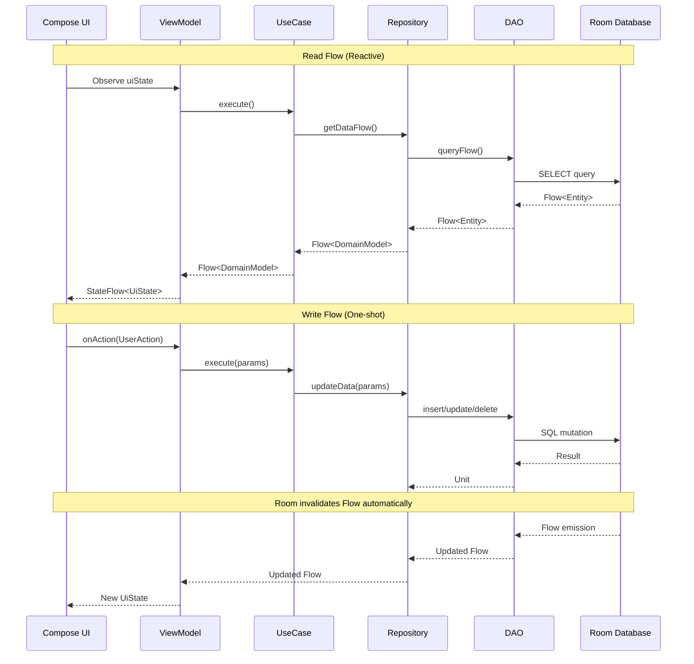
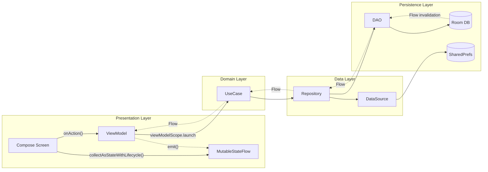
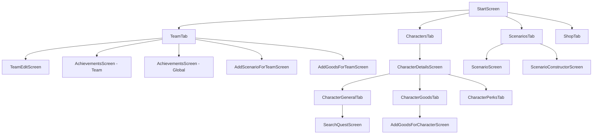

# Gloomhaven Helper - Technical Architecture Documentation

## Database Layer (Room/SQLite)

### Database Configuration

- **Database Name:** `glHelperDatabase`
- **Version:** 3

### Localization model

Catalog content is split into **locale-invariant base tables** and **per-locale translation tables**. Translatable entities key on stable string **slugs** (or display numbers) rather than autogenerated ints, so user progress and game logic survive a destructive reseed. Translation is resolved in SQL: queries `LEFT JOIN` the translation table for the target and default locale and pick text via `COALESCE(target, default, <stable id>)`. See `CLAUDE.md` → Localization for the query/fallback pattern.

| Base table | Translation table(s) | Translated fields |
|------------|----------------------|-------------------|
| `GoodBd` | `GoodTranslationsBd` | name |
| `MonsterBd` | `MonsterTranslationsBd`, `MonsterTextStatsBd` | name, stat text |
| `ScenarioBd` | `ScenarioTranslationsBd` | name |
| `LocationBd` | `LocationTranslateBd` | location name (used by scenarios) |
| `AchievementBd` | `AchievementTranslateBd` | name |
| `PerkBd` | `PerkTranslationBd` | perk text |
| `PersonalQuestBd` | `PersonalQuestTranslationsBd`, `PersonalQuestTaskTranslationsBd` | title, description, specialText, task text |

### Entity-Relationship Diagram

```mermaid
erDiagram
    TeamBd ||--o{ CharacterBd : "has"
    TeamBd ||--o{ TeamScenarioBd : "has"
    TeamBd ||--o{ TeamGoodBd : "has"
    TeamBd ||--o{ TeamCharacterClassBd : "has"
    ScenarioBd ||--o{ TeamScenarioBd : "referenced by"
    ScenarioBd ||--o{ ScenarioTranslationsBd : "translated by"
    LocationBd ||--o{ LocationTranslateBd : "translated by"
    CharacterBd ||--o{ CharacterGoodBd : "owns"
    CharacterBd ||--o{ CharacterPerkBd : "has"
    CharacterBd ||--o{ CharacterPersonalQuestBd : "assigned"
    GoodBd ||--o{ CharacterGoodBd : "referenced by"
    GoodBd ||--o{ TeamGoodBd : "referenced by"
    GoodBd ||--o{ GoodTranslationsBd : "translated by (displayNumber)"
    PerkBd ||--o{ PerkTranslationBd : "translated by"
    PersonalQuestBd ||--o{ CharacterPersonalQuestBd : "referenced by"
    PersonalQuestBd ||--o{ PersonalQuestTranslationsBd : "translated by"
    PersonalQuestBd ||--o{ PersonalQuestTaskTranslationsBd : "translated by"
    MonsterBd ||--o{ MonsterStatsBd : "has stats"
    MonsterBd ||--o{ MonsterTranslationsBd : "translated by"
    MonsterBd ||--o{ MonsterTextStatsBd : "translated stat text"
    MonsterBd }o--o{ MonsterAbilityCardBd : "uses deck by deckName"
    AchievementBd ||--o{ AchievementTranslateBd : "translated by"

    TeamBd {
        int teamId PK "AUTOINCREMENT"
        string name
        string achievements "JSON List<Achievement>"
        int reputation
        int prosperity
        int churchValue
        string packs "JSON List<String>"
        int difficultyLevel
    }

    CharacterBd {
        int characterId PK "AUTOINCREMENT"
        string name
        int level
        int experience
        int goldCount
        string characterType "enum CharacterClassType"
        int teamId FK "NULLABLE"
        boolean isAlive
        string notes
        int checkMarkCount
        int additionalContOfPerks
    }

    ScenarioBd {
        int scenarioNumber PK
        string newScenarios
        string requirements
        string monsters "JSON List<String> slugs"
        string location "location slug"
        string pack
    }

    ScenarioTranslationsBd {
        int scenarioNumber PK_FK
        string locale PK
        string name
    }

    GoodBd {
        int goodId PK "AUTOINCREMENT"
        int displayNumber
        string type
        int cost
        string image
        string pack
        boolean is_drawing
    }

    GoodTranslationsBd {
        int displayNumber PK
        string locale PK
        string name
    }

    PerkBd {
        int count
        string characterType PK "enum CharacterClassType"
    }

    PerkTranslationBd {
        int perkId PK
        string locale PK
        string characterType PK
        string text
    }

    MonsterBd {
        string slug PK
        string deckName "references ability card deck"
        boolean isBoss
        boolean fly
        boolean lifeMultiple
        string immunity "JSON List<MonsterStatType>"
        string pack "enum PackType"
    }

    MonsterTranslationsBd {
        string slug PK_FK
        string locale PK
        string name
    }

    MonsterStatsBd {
        string monsterSlug PK_FK
        int scenarioLevel PK
        boolean isElite PK
        int life
        string stats "JSON List<MonsterAction>"
    }

    MonsterTextStatsBd {
        string monsterSlug PK_FK
        int scenarioLevel PK
        boolean isElite PK
        string locale PK
        string stats "JSON List<MonsterAction.Text>"
    }

    AchievementBd {
        string slug PK
        string pack
        int maxRang
        boolean isGlobal
    }

    AchievementTranslateBd {
        string slug PK_FK
        string locale PK
        string name
    }

    LocationBd {
        string slug PK
    }

    LocationTranslateBd {
        string slug PK_FK
        string locale PK
        string name
    }

    PersonalQuestBd {
        string questId PK
        string characterType "NULLABLE"
        string tasks "JSON List<CharacterTaskItem>"
        string pack
    }

    PersonalQuestTranslationsBd {
        string questId PK_FK
        string locale PK
        string title
        string description
        string specialText
    }

    PersonalQuestTaskTranslationsBd {
        string questId PK_FK
        string locale PK
        int taskId PK
        string text
    }

    TeamGoodBd {
        int teamId PK_FK
        int goodId PK_FK
    }

    ScenarioGameStateBd {
        int id PK "AUTOINCREMENT"
        int scenarioNumber "NULLABLE"
        string monsterSlugs "JSON List<String>"
        int round
        string availableCards "JSON List<Int>"
        string activeMonsters "JSON"
        string magicChargeMap "JSON"
    }
```

**Notes:**
- Character classes are stored as enum `CharacterClassType` in code, not a table. `TeamCharacterClassBd` tracks unlocked classes per team.
- `GoodTranslationsBd` joins on `displayNumber`, not `goodId`. Multiple `GoodBd` rows share the same `displayNumber` (the filler inserts `count` physical copies of an item), so one translation maps to many goods — a one-to-many keyed on `displayNumber`. `goodId` (the autoincrement PK) is unique per copy and therefore the wrong key for translation; `displayNumber` is not unique in `GoodBd`, so it can't be a foreign-key target. The absence of an FK here is intentional, not an oversight.
- `PerkBd` is keyed by `characterType` only; `PerkTranslationBd` keys on `(perkId, locale, characterType)` with no FK to `PerkBd`.
- `MonsterAbilityCardBd` is not translated (cards are image-based: `imageName`).

### Entity & DAO reference

The authoritative, always-current schema is the generated Room export at
`app/schemas/com.rumpilstilstkin.gloomhavenhelper.bd.GlHelperDatabase/3.json`
(column types, constraints, indices, foreign keys). The ER diagram and localization
table above summarize the structure; consult the JSON export rather than a hand-kept
copy here, which drifts. DAO interfaces live in `bd/dao/`.

**Conventions worth knowing when reading the DAOs:**

- Read queries for translated entities take `targetLocale` + `defaultLocale` parameters
  and return `*WithTranslation` / `*WithNameBd` projection rows (base columns + a resolved
  text column), not raw entities. Repositories map these to domain models.
- Each base entity has a paired `@Insert` for its translation rows (e.g.
  `GoodsDao.insertAll(vararg translations: GoodTranslationsBd)`), used by the JSON fillers.
- `ScenarioGameStateDao.clearAndInsert` wraps `deleteAll()` + `insert()` in a `@Transaction`
  (single-row table; replaces the old name-keyed upsert).
- Static catalog reads (goods, scenarios, achievements, monsters) are `suspend` one-shots;
  user-owned data (characters, team goods, perks) is exposed as `Flow` for reactive UI.

### TypeConverters

JSON (de)serialization of complex columns lives in `bd/typeconverters/`:

- `AchievementConverter` — `List<Achievement>` for `TeamBd.achievements`.
- `ListCharacterTaskItemTypeConverter` — `List<CharacterTaskItem>` for `PersonalQuestBd.tasks` and `CharacterPersonalQuestBd.tasks`.
- `MonsterTypeConverters` — `List<MonsterStatType>` (`MonsterBd.immunity`) and `List<MonsterAction>` (`MonsterStatsBd.stats`, `MonsterTextStatsBd.stats`, `MonsterAbilityCardBd`).
- `ScenarioConverters` — `List<Int>`, `List<ScenarioGameStateMagic>`, `List<ScenarioGameStateMonsterItem>`, and `List<String>` for `ScenarioGameStateBd` and slug lists.

---

## Business Logic & Architecture

### Dependency Injection Graph

```mermaid
flowchart TB
    subgraph Hilt["Hilt DI Container"]
        subgraph SingletonComponent["@Singleton Scope"]
            SP[SharedPreferences]
            DB[(GlHelperDatabase)]

            subgraph DAOs["DAO Layer"]
                TeamDao
                CharacterDao
                GameLevelInfoDao
                ScenarioDao
                TeamScenarioDao
                GoodsDao
                CharacterGoodsDao
                TeamGoodDao
                TeamCharacterClassDao
                PerksDao
                MonsterDao
                CharacterPerksDao
                PersonalQuestDao
                CharacterPersonalQuestDao
                AchievementDao
                ScenarioGameStateDao
            end

            subgraph Dispatchers["Coroutine Dispatchers"]
                DefaultDispatcher
                IoDispatcher
                MainDispatcher
                ApplicationScope
            end
        end
    end

    DB --> TeamDao
    DB --> CharacterDao
    DB --> GameLevelInfoDao
    DB --> ScenarioDao
    DB --> TeamScenarioDao
    DB --> GoodsDao
    DB --> CharacterGoodsDao
    DB --> TeamGoodDao
    DB --> TeamCharacterClassDao
    DB --> PerksDao
    DB --> CharacterPerksDao
    DB --> PersonalQuestDao
    DB --> CharacterPersonalQuestDao
    DB --> AchievementDao
    DB --> MonsterDao
    DB --> ScenarioGameStateDao

    SP --> CurrentTeamDatasource

    subgraph Repositories["Repository Layer"]
        TeamRepository
        CharacterRepository
        CharacterClassRepository
        ScenarioRepository
        GoodsRepository
        PerksRepository
        QuestsRepository
        LevelInfoRepository
        AchievementRepository
        MonsterRepository
        ScenarioGameStateRepository
        CurrentTeamDatasource
    end

    TeamDao --> TeamRepository
    CharacterDao --> TeamRepository
    CharacterDao --> CharacterRepository
    CharacterGoodsDao --> CharacterRepository
    CharacterPerksDao --> CharacterRepository
    CharacterPersonalQuestDao --> CharacterRepository
    ScenarioDao --> ScenarioRepository
    TeamScenarioDao --> ScenarioRepository
    GoodsDao --> GoodsRepository
    TeamGoodDao --> GoodsRepository
    TeamCharacterClassDao --> CharacterClassRepository
    PerksDao --> PerksRepository
    PersonalQuestDao --> QuestsRepository
    CharacterPersonalQuestDao --> QuestsRepository
    GameLevelInfoDao --> LevelInfoRepository
    AchievementDao --> AchievementRepository
    MonsterDao --> MonsterRepository
    ScenarioGameStateDao --> ScenarioGameStateRepository
    CurrentTeamDatasource --> TeamRepository
    CharacterRepository --> TeamRepository
    ApplicationScope --> TeamRepository
```



### Repository Layer

| Repository | Scope | Dependencies | Reactive Streams |
|------------|-------|--------------|------------------|
| `TeamRepository` | `@Singleton` | `TeamDao`, `CharacterDao`, `CharacterRepository`, `CurrentTeamDatasource`, `@ApplicationScope CoroutineScope` | `currentTeamId: Flow<Int>`, `currentTeam: Flow<TeamInfo?>`, `getTeams(): Flow<List>`, `getTeamWithScenarioFlow(): Flow` |
| `CharacterRepository` | — | `CharacterDao`, `TeamDao`, `CharacterGoodsDao`, `CharacterPerksDao`, `CharacterPersonalQuestDao` | `getCharacterPerksFlow()`, `getCharacterGoodsFlow()`, `getCharacterByTeamId()`, `getCharacterByIdFlow()`, `getCharacterPersonalQuestFlow()` |
| `CharacterClassRepository` | `@Singleton` | `TeamCharacterClassDao` | `getAvailableClassesForTeam(): Flow<List<CharacterClassType>>` |
| `ScenarioRepository` | — | `ScenarioDao`, `TeamScenarioDao` | `getTeamScenariosFlow()` |
| `GoodsRepository` | — | `GoodsDao`, `TeamGoodDao` | `getTeamGoodsFlow()` |
| `PerksRepository` | — | `PerksDao` | — |
| `QuestsRepository` | — | `PersonalQuestDao`, `CharacterPersonalQuestDao` | `getQuestsFlow(): Flow<List<PersonalQuest>>` |
| `LevelInfoRepository` | `@Singleton` | `GameLevelInfoDao` | — (uses caching) |
| `AchievementRepository` | — | `AchievementDao` | — |
| `MonsterRepository` | — | `MonsterDao` | — |
| `ScenarioGameStateRepository` | `@Singleton` | `ScenarioGameStateDao` | `getFlow(): Flow<ScenarioGameStateBd?>` |
| `CurrentTeamDatasource` | `@Singleton` | `SharedPreferences` | — |

**Note:** Character classes are no longer stored in database. `CharacterClassRepository` works with `CharacterClassType` enum directly and only uses `TeamCharacterClassDao` to track unlocked classes per team.

### Use Cases

#### Team Domain
| UseCase | Dependencies | Operation |
|---------|--------------|-----------|
| `GetCurrentTeamUseCase` | `TeamRepository` | Retrieves current team info flow |
| `GetCurrentTeamShortInfoUseCase` | `TeamRepository` | Retrieves current team short info flow |
| `GetCurrentTeamWithTeamsUseCase` | `TeamRepository` | Retrieves current team with all teams |
| `GetTeamInfoUseCase` | `TeamRepository` | Retrieves team info by ID |
| `SaveTeamUseCase` | `TeamRepository`, `ScenarioRepository` | Saves team and initial scenario |
| `ChangeCurrentTeamUseCase` | `TeamRepository` | Changes current team |
| `DeleteCurrentTeamUseCase` | `TeamRepository` | Deletes current team |
| `UpdateNameForCurrentTeamUseCase` | `TeamRepository` | Updates team name |
| `SwitchPackForCurrentTeamUseCase` | `TeamRepository` | Enables/disables pack for team |
| `UpdateTeamReputationUseCase` | `TeamRepository` | Updates team reputation |
| `UpdateTeamProsperityUseCase` | `TeamRepository` | Updates team prosperity |
| `GetTeamProsperityUseCase` | `TeamRepository` | Gets team prosperity |
| `GetDiscountByReputationUseCase` | `TeamRepository` | Calculates shop discount |
| `GetNextChurchValueUseCase` | `TeamRepository` | Gets next church donation value |

#### Achievement Domain
| UseCase | Dependencies | Operation |
|---------|--------------|-----------|
| `GetAvailableTeamAchievementsUseCase` | `TeamRepository`, `AchievementRepository` | Gets unearned team achievements |
| `GetAvailableGlobalAchievementsUseCase` | `TeamRepository`, `AchievementRepository` | Gets unearned global achievements |
| `UpdateTeamAchievementUseCase` | `TeamRepository` | Adds/updates team achievement |
| `UpdateGlobalAchievementUseCase` | `TeamRepository` | Adds/updates global achievement |
| `RemoveTeamAchievementUseCase` | `TeamRepository` | Removes team achievement |
| `RemoveGlobalAchievementUseCase` | `TeamRepository` | Removes global achievement |

#### Character Domain
| UseCase | Dependencies | Operation |
|---------|--------------|-----------|
| `GetCharacterDetailsInfoUseCase` | `CharacterRepository` | Character details flow |
| `GetCharacterGeneralInfoUseCase` | `CharacterRepository` | Character info |
| `GetCharacterGeneralInfoFlowUseCase` | `CharacterRepository` | Character info flow |
| `GetCharactersForCurrentTeamUseCase` | `CharacterRepository`, `TeamRepository` | Characters for current team |
| `GetCharacterPerksUseCase` | `CharacterRepository` | Character perks |
| `CreateCharacterUseCase` | `CharacterRepository` | Creates new character |
| `DeleteCharacterUseCase` | `CharacterRepository` | Deletes character |
| `RetireCharacterUseCase` | `CharacterRepository` | Retires character |
| `LevelUpUseCase` | `CharacterRepository` | Level increment |
| `UpdateCharacterLevelUseCase` | `CharacterRepository` | Sets specific level |
| `UpdateCharacterNameUseCase` | `CharacterRepository` | Updates character name |
| `ExperienceChangeUseCase` | `CharacterRepository` | Experience update |
| `UpdateGoldUseCase` | `CharacterRepository` | Gold update |
| `UpdateNotesUseCase` | `CharacterRepository` | Notes update |
| `MarksCheckedChangeUseCase` | `CharacterRepository` | Check marks update |
| `DonateUseCase` | `CharacterRepository` | Gold donation |
| `SetTeamUseCase` | `CharacterRepository` | Team assignment |

#### Character Goods Domain
| UseCase | Dependencies | Operation |
|---------|--------------|-----------|
| `GetCharacterGoodsUseCase` | `CharacterRepository`, `GoodsRepository` | Character goods flow |
| `GetAvaliableCharacterGoodsUseCase` | `CharacterRepository`, `GoodsRepository` | Available goods list |
| `AddGoodForCharacterUseCase` | `CharacterRepository` | Add good without payment |
| `BuyGoodForCharacterUseCase` | `CharacterRepository` | Buy good with gold deduction |
| `SellGoodCharacterUseCase` | `CharacterRepository`, `GoodsRepository` | Sell good with gold refund |
| `DeleteCharacterGoodsUseCase` | `CharacterRepository` | Remove good |

#### Character Perks Domain
| UseCase | Dependencies | Operation |
|---------|--------------|-----------|
| `GetCharacterPerksInfoUseCase` | `CharacterRepository`, `PerksRepository` | Perks with selection state |
| `AddPerksForCharacterUseCase` | `CharacterRepository` | Add perk |
| `DeleteCharacterPerkUseCase` | `CharacterRepository` | Remove perk |

#### Character Quests Domain
| UseCase | Dependencies | Operation |
|---------|--------------|-----------|
| `SetQuestForCharacterUseCase` | `QuestsRepository` | Assign quest |
| `QuestTaskUpdateUseCase` | `QuestsRepository`, `CharacterRepository` | Update task progress |

#### Team Goods Domain
| UseCase | Dependencies | Operation |
|---------|--------------|-----------|
| `GetGoodsForCurrentTeamUseCase` | `GoodsRepository`, `TeamRepository` | Gets team goods |
| `GetAvaliableGoodsForTeamUseCase` | `GoodsRepository`, `TeamRepository` | Gets available goods for team |
| `GetGoodNumbersForLevelUseCase` | — | Gets good numbers by prosperity level |
| `AddGoodToTeamUseCase` | `GoodsRepository` | Adds single good to team |
| `AddGoodsToTeamByNumbersUseCase` | `GoodsRepository` | Adds multiple goods by numbers |
| `RemoveGoodFromCurrentTeamUseCase` | `GoodsRepository`, `TeamRepository` | Removes good from current team |

#### Character Classes Domain
| UseCase | Dependencies | Operation |
|---------|--------------|-----------|
| `AddCharacterClassForTeamUseCase` | `CharacterClassRepository` | Unlocks class for team |
| `RemoveCharacterClassForTeamUseCase` | `CharacterClassRepository` | Locks class for team |
| `GetAvaliableClassesForCurrentTeamUseCase` | `CharacterClassRepository`, `TeamRepository` | Gets available classes for current team |

#### Quests Domain
| UseCase | Dependencies | Operation |
|---------|--------------|-----------|
| `GetQuestsFlowUseCase` | `QuestsRepository` | All quests flow |

#### Scenario Domain
| UseCase | Dependencies | Operation |
|---------|--------------|-----------|
| `GetTeamScenariosUseCase` | `ScenarioRepository`, `TeamRepository` | Gets team scenarios |
| `GetAvailableScenariosForTeamUseCase` | `ScenarioRepository`, `TeamRepository` | Gets scenarios not yet added |
| `FilterTeamScenariosUseCase` | — | Filters scenarios by status |
| `GetScenarioInfoUseCase` | `ScenarioRepository` | Gets scenario details |
| `AddScenarioToTeamUseCase` | `ScenarioRepository`, `TeamRepository` | Adds scenario to team |
| `CompleteScenarioUseCase` | `ScenarioRepository` | Mark scenario completed |
| `CreateActiveScenarioUseCase` | `ScenarioGameStateRepository`, `MonsterRepository` | Creates active scenario state |
| `SaveScenarioStateUseCase` | `ScenarioGameStateRepository` | Saves current scenario state |
| `RestoreScenarioStateUseCase` | `ScenarioGameStateRepository` | Restores saved scenario state |
| `ClearCurrentActiveScenarioUseCase` | `ScenarioGameStateRepository` | Clears active scenario |
| `GetAvailableMonstersForTeamUseCase` | `TeamRepository`, `MonsterRepository`, `ScenarioGameStateRepository` | Gets monsters available for team |
| `AddMonstersForCurrentScenarioUseCase` | `ScenarioGameStateRepository`, `MonsterRepository` | Adds monsters to current scenario |
| `GetMonsterForScenarioUseCase` | `MonsterRepository` | Gets monster by name |
| `GetMonsterStatsForLevelUseCase` | `MonsterRepository` | Gets monster stats for level |

### Data Flow Diagram



### State Management Flow



---

## UI Layer

### Navigation Structure



### Navigation Routes (GlHelperScreens)

| Route | Type | Description |
|-------|------|-------------|
| `Start` | object | Main tab-based screen |
| `EditCurrentTeam` | object | Team editing screen |
| `Scenario` | object | Active scenario play screen |
| `ScenarioConstructor` | object | Custom scenario builder |
| `CharacterDetails(characterId)` | data class | Character details with tabs |
| `AddGoodsForCharacter(characterId)` | data class | Item shop for character |
| `SearchPersonalQuest(characterId)` | data class | Quest selection |
| `AddGoodsForTeam` | object | Team goods management |
| `AddScenarioForTeam` | object | Add scenario to team |
| `TeamAchievements` | object | Team achievements screen |
| `GlobalAchievements` | object | Global achievements screen |

### Main Screens

| Screen | Purpose |
|--------|---------|
| `MainActivity` | Application entry point; handles database initialization via `MainActivityViewModel`. |
| `StartScreen` | Tab-based screen with Team, Characters, Scenarios, and Shop tabs. |
| `EmptyTeamScreen` | Shown when no team exists; prompts team creation. |
| `TeamTabScreen` | Displays current team details including reputation, prosperity, achievements, and packs. |
| `CharactersTabScreen` | Lists all characters with navigation to character details. |
| `ScenariosTabScreen` | Lists team scenarios with filtering by status. |
| `ShopTabScreen` | Team goods management and shop. |
| `TeamEditScreen` | Team editing: name, packs, delete team, change team. |
| `AchievementsScreen` | Team/Global achievements management (reused for both types). |
| `AddScenarioForTeamScreen` | Scenario selection for team progression. |
| `AddGoodsForTeamScreen` | Team goods management. |
| `CharacterDetailsScreen` | Tab-based character view with General, Items, and Perks tabs. |
| `AddGoodsForCharacterScreen` | Item shop interface for purchasing/adding goods to character. |
| `SearchQuestScreen` | Personal quest selection interface. |
| `ScenarioScreen` | Active scenario play with monster management and ability card pager. |
| `ScenarioConstructorScreen` | Custom scenario builder for selecting monsters. |

### Dialogs

| Dialog | Purpose |
|--------|---------|
| `AddCharacterDialog` | Character class selection for adding new character. |
| `AddPerksDialog` | Perk selection for character. |
| `CharacterEditLevelDialog` | Level editing for character. |
| `CharacterEditNameDialog` | Name editing for character. |
| `DeleteCharacterDialog` | Confirmation for character deletion. |
| `AddTeamDialog` | Team creation dialog. |
| `TeamListDialog` | Team selection dropdown. |
| `DeleteTeamConfirmDialog` | Confirmation for team deletion. |
| `GoodDetailsDialog` | Item detail view. |
| `QuestDetailsDialog` | Quest detail view. |
| `ReputationDialog` | Team reputation editing. |
| `ProsperityDialog` | Team prosperity editing. |
| `ScenarioLevelInfoDialog` | Scenario level information display. |
