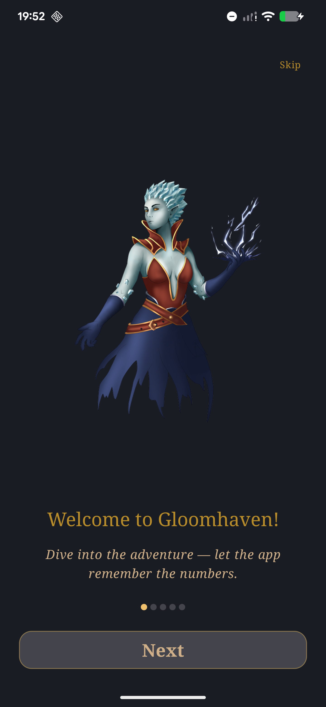
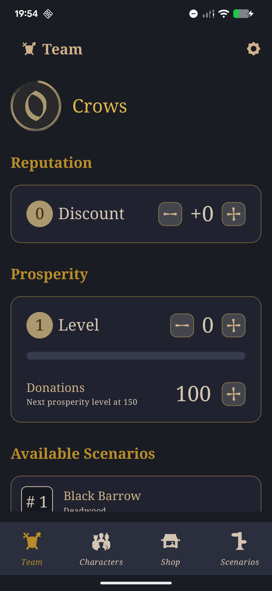
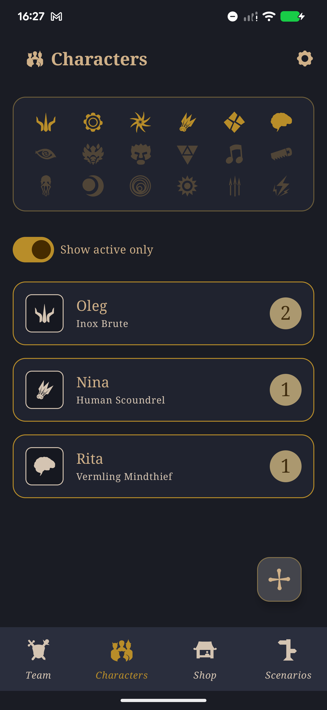
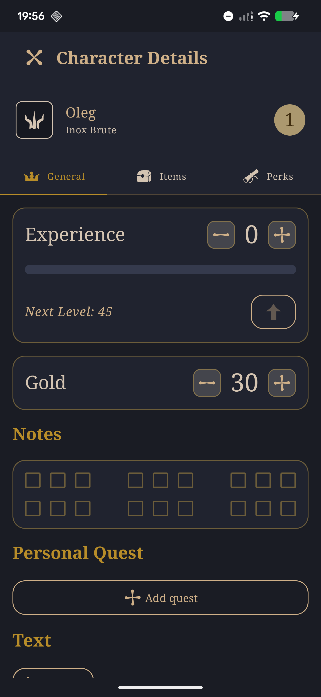
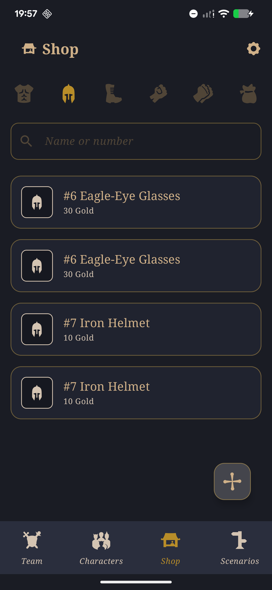
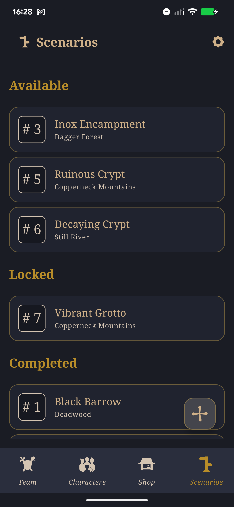
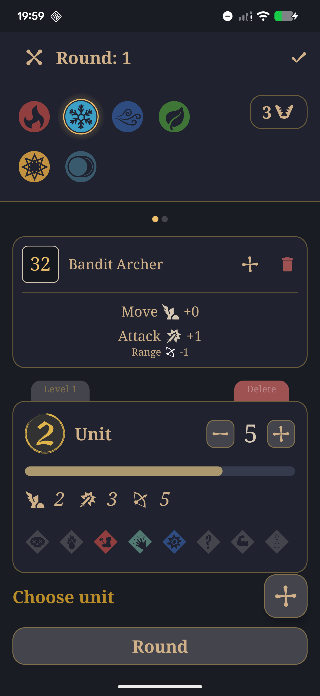
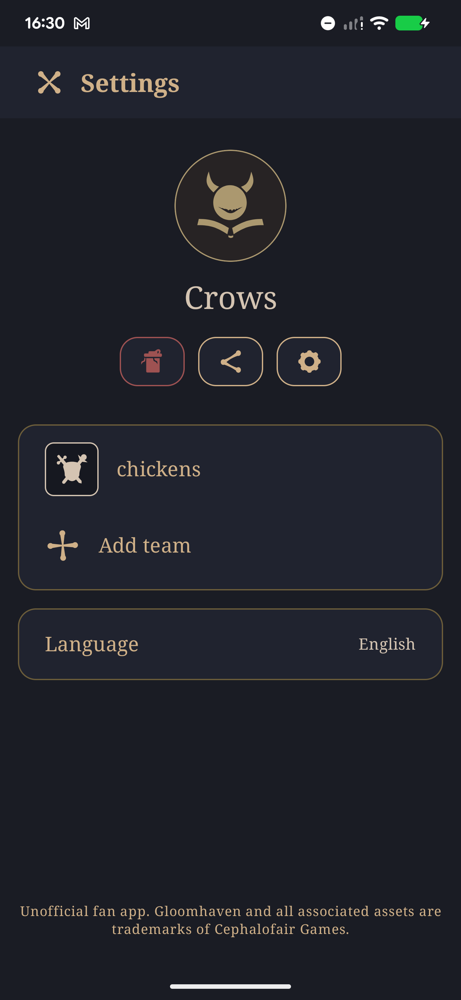

  

  <h1 align="center">GloomMaster</h1>
  <h3>Android companion app for the Gloomhaven board game</h3>

  

    <a href="https://github.com/NinaTverdohleb/GloomMaster/releases">Releases</a>
    &middot;
    <a href="https://github.com/NinaTverdohleb/GloomMaster/releases">Download</a>
    &middot;
    <a href="https://github.com/NinaTverdohleb/GloomMaster/issues/new?labels=bug&template=bug_report.md">Report Bug</a>
    &middot;
    <a href="https://github.com/NinaTverdohleb/GloomMaster/issues/new?labels=enhancement&template=feature_request.md">Request Feature</a>
  

  
  
  

  

  

    Screenshots
  

  
  

    
    &nbsp;
    
    &nbsp;
    
    &nbsp;
    
  

  
  

    
    &nbsp;
    
    &nbsp;
    
    &nbsp;
    
    &nbsp;
  

  
Table of Contents

  <ul>
    <li><a href="#features">Features</a></li>
    <li><a href="#1-onboarding">1. Onboarding</a></li>
    <li><a href="#2-team-management">2. Team Management</a></li>
    <li><a href="#3-working-with-characters">3. Working with Characters</a></li>
    <li>
      <a href="#4-character-details">4. Character Details</a>
      <ul>
        <li><a href="#41-character-perks">4.1. Character Perks</a></li>
        <li><a href="#42-character-inventory">4.2. Character Inventory</a></li>
      </ul>
    </li>
    <li><a href="#5-shop--items">5. Shop / Items</a></li>
    <li><a href="#6-scenarios">6. Scenarios</a></li>
    <li><a href="#7-active-battle--scenario-play">7. Active Battle / Scenario Play</a></li>
    <li><a href="#8-settings-and-localization">8. Settings and Localization</a></li>
    <li><a href="#technical-features">Technical Features</a></li>
    <li><a href="#tech-stack">Tech Stack</a></li>
    <li><a href="#license">License</a></li>
  </ul>

## Features

## 1. Onboarding

- Step-by-step slides (illustration + title + text) on first launch; shown once,
  after which the main screen opens directly.

## 2. Team Management

- Create and store **multiple teams**, with quick switching of the current team.
- **Renaming** a team.
- **Reputation** — adjustable within the −20…+20 range (per the game rules);
  affects shop discounts.
- **Prosperity** — changes per the game rules: stored as a single cumulative
  value from which the prosperity level (1–9) is derived by fixed thresholds.
  When the level increases, new items of that level are automatically added to
  the team's shop. Bounded below by the starting value and above by the maximum
  level.
- **Difficulty level** of the game, set per team.
- **Donations to the church (donate)** — raises prosperity through donations,
  with the next threshold calculated.
- **Reputation discounts** — the shop price depends on the team's reputation.
- **Expansion packs** — attaching expansions to a team (base set +
  Forgotten Circles).
- **Deleting a team** (the current one or an arbitrary one).
- **Team export / import** — export the team's entire progress to a JSON file
  (share) and import it back.
- **Team achievements** — view, add, remove, and change the value for
  achievements that have levels.
- **Global achievements** — view, add, remove, and change the value for
  achievements that have levels.

## 3. Working with Characters

- Managing the team's unlocked **character classes** (add / remove), accounting
  for classes already available.
- Creating new characters for the team (no more than 4 active) — the number of
  perks available to a character accounts for characters retired before it was
  created.
- Deleting characters.
- Retiring a character.
- Bringing retired characters back.

## 4. Character Details

- Full character sheet: **level, experience, gold, notes**, name.
- **Level up** — explicitly raises the character's level and recalculates the
  number of available perks.
- **Check marks** for unlocking perks (change the number of perks available to
  add).
- Assigning a personal quest to a character (search / pick from a list).
- Tracking progress on the quest's tasks (marking completed tasks).

### 4.1. Character Perks

- Choosing perks according to the **character class** (class-specific options).
- Adding and removing perks; the number of perks available to add is a hint, not
  a hard limit — for special game conditions a perk can be added beyond it.

### 4.2. Character Inventory

- Managing the character's items: **buy for gold**, sell, remove.
- The list of items available to buy depends on the team's pool and the pool of
  active characters.
- The purchase price accounts for the team's **reputation discount**.
- Besides buying, there's an option to add items without deducting from the
  wallet.

## 5. Shop / Items

- Browsing items available to the team (by prosperity level); items already held
  by active characters are not shown.
- **Team item pool** — adding items to the shared pool (by number / by level)
  and removing them from the pool.

## 6. Scenarios

- The team's scenario list with **filtering**; available scenarios depend on the
  team's progress.
- Adding a scenario to the team, removing a scenario.
- **Completing a scenario** with the result recorded.

## 7. Active Battle / Scenario Play

- **Adding monsters** to the battle and **units** (normal / elite) with numbers.
- **Unit level** and **life (HP)** — editable per unit.
- **Effects / conditions** on units (toggling status effects by type) — not
  cleared automatically on a round change.
- **Monster ability card deck** — drawing cards per deck, with a deterministic
  randomness source.
- **Round counter** (advancing to the next round).
- **Magic charges (elements)** — toggling element charge levels, waning between
  rounds.
- **Monster stats by level** (normal and elite).
- **Saving and restoring battle state** across sessions, including the team
  level: you can return to an active battle at any time, even after fully closing
  the app.
- Removing monsters and individual units from the battle.

---

## 8. Settings and Localization

- Settings screen: current language, current team, team list with switching,
  adding / removing a team, sharing a team.
- **Changing the app language** (language picker dialog).
- **Reactive multi-language support** — a language change is applied on the fly,
  without restarting the app.

---

## Technical Features

- **Offline-first**: the entire game catalog (monsters, items, scenarios, perks,
  quests, locations) is loaded from JSON assets into Room on first launch (gated
  by `filler_version`), per pack and per locale.
- **Baseline Profile** for faster startup; **Macrobenchmark** tests for key UI
  flows.
- **Screenshot tests** (Roborazzi) for `:design-system`.

## Resources
— All design assets and icons were created by humans. The code was generated using AI tools under human architecture and review.
— Product images, description texts, and item names are used under the Creative Commons BY-NC-SA 4.0 license.

## Tech Stack

| Category | Technology |
|----------|------------|
| Language | Kotlin 2.3 |
| UI | Jetpack Compose + Material3 |
| Architecture | Clean Architecture (Presentation → Domain → Data) |
| Database | Room |
| DI | Hilt |
| Async | Kotlin Coroutines + Flow |
| Serialization | Kotlin Serialization |
| Navigation | Compose Navigation (Type-safe) |
| Image Loading | Coil |

## License

This project is for personal use. Gloomhaven is a trademark of Cephalofair Games.

  Made with Kotlin and Jetpack Compose

