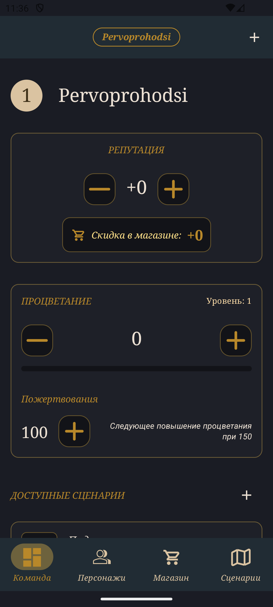
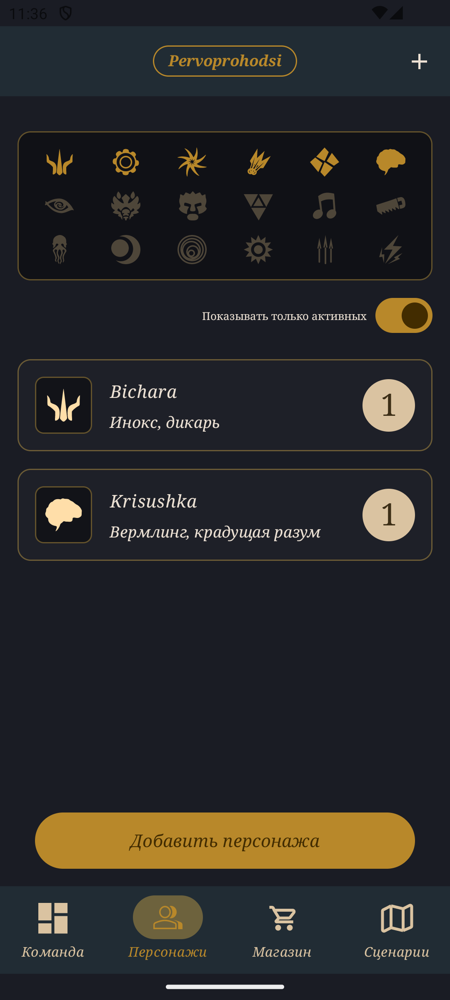
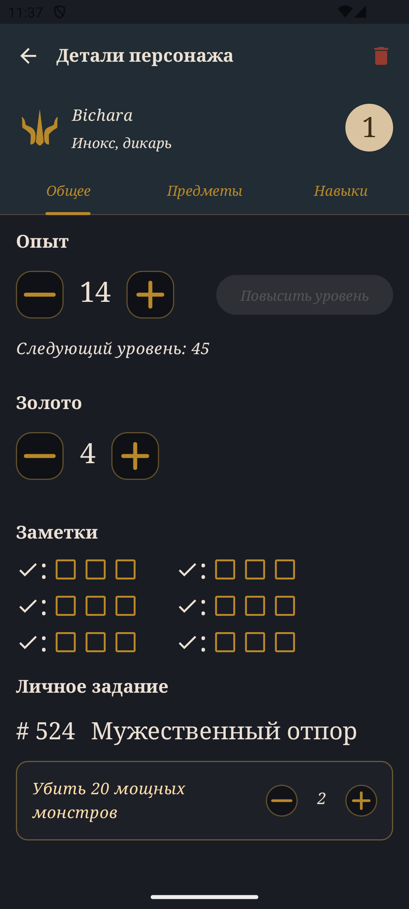
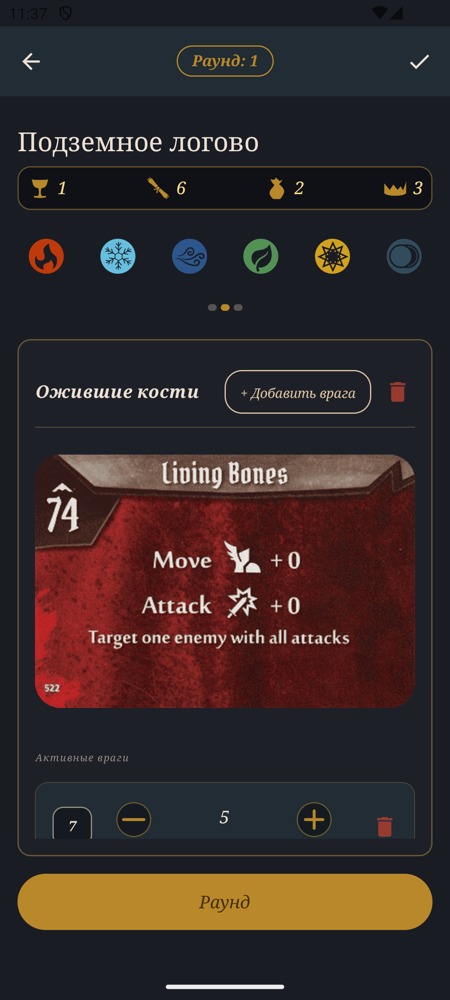

# Gloomhaven Helper

<p align="center">
  <strong>Android companion app for the Gloomhaven board game</strong>
</p>

<p align="center">
  
  
  
</p>

---

## Features

### Team Management
- Create and manage multiple teams
- Track team reputation and prosperity
- Manage team and global achievements
- Unlock character classes and expansion packs

### Character Tracking
- Full character sheet: level, experience, gold, notes
- Personal quest assignment and progress tracking
- Perk selection with class-specific options
- Item inventory management with buy/sell functionality
- Check mark tracking for perk unlocks

### Scenario Play
- Active scenario management with monster tracking
- Monster ability card deck with initiative ordering
- Elite and normal monster stat display per level
- Round counter and game state persistence
- Custom scenario constructor for any monster combination

### Item Shop
- Browse items by prosperity level
- Team item pool management
- Character item purchases with gold tracking

---

## Screenshots

<p align="center">
  
  
  
  
</p>

---

## Tech Stack

| Category | Technology |
|----------|------------|
| Language | Kotlin 2.3 |
| UI | Jetpack Compose + Material3 |
| Architecture | Clean Architecture (Presentation → Domain → Data) |
| Database | Room |
| DI | Hilt |
| Async | Kotlin Coroutines + Flow |
| Serialization | Kotlin Serialization |
| Navigation | Compose Navigation (Type-safe) |
| Image Loading | Coil |

---

## Architecture

The app follows **Clean Architecture** principles with clear separation of concerns:

```
┌─────────────────────────────────────────────────────────┐
│                    Presentation                          │
│  Compose UI ← ViewModel ← StateFlow<UiState>            │
├─────────────────────────────────────────────────────────┤
│                      Domain                              │
│  UseCases ← Entity Models ← Error Types                 │
├─────────────────────────────────────────────────────────┤
│                       Data                               │
│  Repositories ← Mappers ← DataSources                   │
├─────────────────────────────────────────────────────────┤
│                    Persistence                           │
│  Room Database ← DAOs ← Entities ← TypeConverters       │
└─────────────────────────────────────────────────────────┘
```

### Key Design Decisions

- **Reactive data flow**: Room `Flow` → Repository → ViewModel `StateFlow` → Compose
- **Type-safe navigation**: `@Serializable` route definitions
- **Character classes as enum**: No database table, tracked via `TeamCharacterClassBd`
- **Scenario state persistence**: Active game state saved to `ScenarioGameStateBd`

---

## Project Structure

```
app/src/main/kotlin/com/rumpilstilstkin/gloomhavenhelper/
├── bd/                    # Room database layer
│   ├── dao/               # Data Access Objects
│   ├── entity/            # Database entities
│   ├── filler/json/       # Initial data from JSON
│   ├── migrations/        # Schema migrations
│   └── typeconverters/    # JSON serialization
├── data/                  # Repository layer
│   ├── datasource/        # SharedPreferences, etc.
│   └── mappers/           # Entity ↔ Domain mapping
├── di/                    # Hilt modules
├── domain/                # Business logic
│   ├── entity/            # Domain models
│   ├── error/             # Error types
│   └── usecase/           # Use cases by feature
├── navigation/            # Navigation setup
├── screens/               # UI screens & ViewModels
└── ui/                    # Shared components & theme
```

---

## Building

### Requirements

- Android Studio Hedgehog or newer
- JDK 11
- Android SDK 36

---

## Database Schema

The app uses Room with 18 entities. Key relationships:

- **Team** → Characters, Scenarios, Goods, Unlocked Classes, Achievements
- **Character** → Goods, Perks, Personal Quest
- **Monster** → Stats (per level), Ability Cards (shared deck)
- **Scenario Game State** → Active monsters, Round, Card deck state

See [ARCHITECTURE.md](ARCHITECTURE.md) for full ER diagram and entity definitions.

---

## Documentation

| Document | Description |
|----------|-------------|
| [ARCHITECTURE.md](ARCHITECTURE.md) | Full technical documentation: database schema, DAOs, repositories, use cases, UI structure |
| [CLAUDE.md](CLAUDE.md) | AI assistant context for code navigation |
| [BACKLOG.md](BACKLOG.md) | Planned improvements and features |

---

## License

This project is for personal use. Gloomhaven is a trademark of Cephalofair Games.

---

<p align="center">
  Made with Kotlin and Jetpack Compose
</p>
